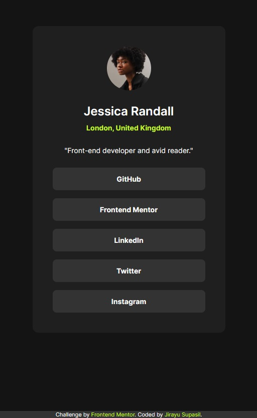

# Frontend Mentor - Blog preview card solution

This is a solution to the [Blog preview card challenge on Frontend Mentor](https://www.frontendmentor.io/challenges/blog-preview-card-ckPaj01IcS). Frontend Mentor challenges help you improve your coding skills by building realistic projects.

## Table of contents

- [Overview](#overview)
  - [Screenshot](#screenshot)
  - [Links](#links)
- [My process](#my-process)
  - [Built with](#built-with)
  - [What I learned](#what-i-learned)
  - [Continued development](#continued-development)
  - [Useful resources](#useful-resources)
- [Author](#author)
- [Acknowledgments](#acknowledgments)

## Overview

### Screenshot

### Links

- Solution URL: [GitHub](https://github.com/jsupasil/frontend-mentor-newbie-blog-preview-card)
- Live Site URL: [Vercel](https://frontend-mentor-newbie-blog-preview-card.vercel.app/)

## My process

### What I learned

### Built with

- Semantic HTML5 markup
- CSS custom properties
- Flexbox
- Shadow-box
- Object-fit

### What I learned

I learned how to design flex box, object-fit, box-shadow and other css properties. Flex box can also be applied for position alignments such as aligning element at center. Object-fit can be use to place the image at specific crop size with out changing its shape. There are some CSS properties that I have to search more and adjust to match with figma design such as drop shadow and border radious.

### Continued development

Learning categories could be link to other address.

### Useful resources

- [CSS box-shadow Property by W3 school](https://www.w3schools.com/cssref/css3_pr_box-shadow.php) - This help me understand the concept of box-shadow which is usefule to apply with shadow effect of the element in this project.

- [CSS box-shadow Property by W3 school](https://www.w3schools.com/css/css3_object-fit.asp) - This help me solve method to fit image into specific area with out adjusting the original shape.

## Author

- Website - [Jirayu Supasil](https://github.com/jsupasil)
- Frontend Mentor - [@jsupasil](https://www.frontendmentor.io/profile/jsupasil)

## Acknowledgments

I acknowledge [Tech Up Software Bootscamp](https://www.techupth.com/) for training and supporting which are vastly helpful to complete this project.
